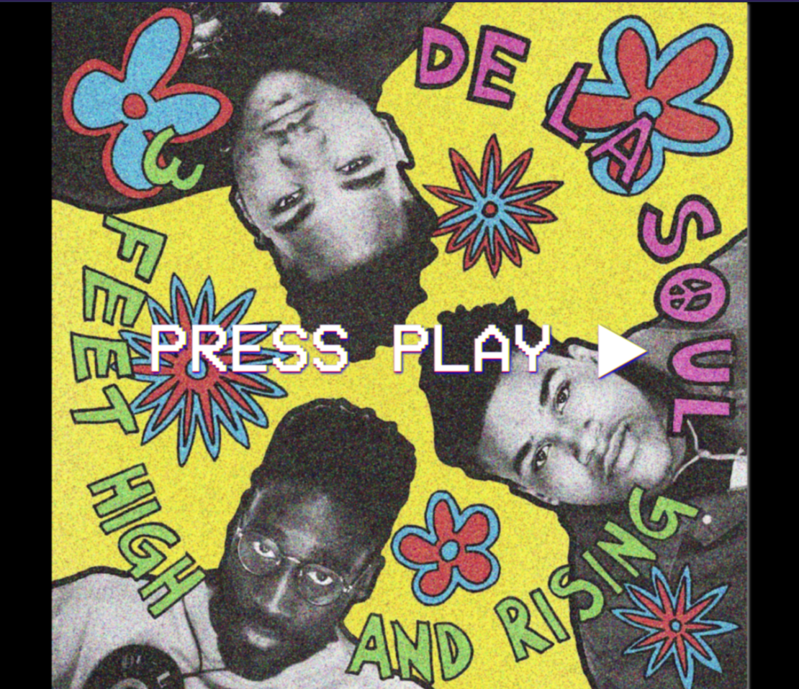

# 🕹️ Animation Glitch Retro « De La Soul Song »

## 🌟 Description  
Projet réalisé en **CSS pur** vers 2020, inspiré par l’esthétique glitch/vintage.  
Affiche une image floutée en fond avec un bouton central animé donnant une ambiance rétro.  
Initialement, le bouton contenait un lien vers une vidéo YouTube.  

Par la suite, un peu de **JavaScript** a été ajouté pour déclencher la lecture d’un fichier audio local lorsqu’on clique sur le bouton.

---

## Aperçu  

[Voir la démo sur GitHub Pages](https://rukendogan.github.io//)

---

## Technologies utilisées  
- HTML5  
- CSS3 (animations, filtres, `@font-face`)  
- JavaScript simple pour déclencher la lecture audio  
- Police personnalisée hébergée en ligne (VCR OSD Mono)

---

## Fonctionnalités  
- Effet glitch animé en continu sur l’image de fond et le bouton  
- Bouton central cliquable qui lance la lecture d’un fichier audio local

---

## Liens  
- Vidéo YouTube originale : [https://youtu.be/pxkOWjZAPLs]  
- Police VCR OSD Mono hébergée via Shopify CDN

---

## Ce que j’ai appris  
- Animation glitch avancée en CSS pur  
- Intégration basique de la lecture audio via JavaScript sur événement clic